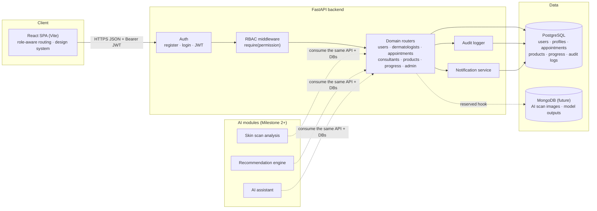

# System Architecture

## Overview

Lumen is a classic three-tier web application with a reserved seam for AI services. The React single-page app talks to a FastAPI backend over a JSON REST API secured with JWT bearer tokens. Relational data lives in PostgreSQL (SQLite in local development); MongoDB is wired in as an optional handle reserved for unstructured payloads (AI scan images, model outputs) in later milestones.

## High-level diagram

## Request lifecycle

1. The SPA attaches `Authorization: Bearer <JWT>` to every request.
2. `get_current_user` decodes the token, loads the user, and rejects suspended accounts.
3. `require("<permission>")` checks the role's permission set (`app/permissions.py`). Administrators implicitly hold every permission.
4. The router executes domain logic; important actions write an `AuditLog` row (actor, action, old/new values, IP) and, where relevant, `Notification` rows for affected users.
5. Pydantic schemas validate input and shape output.

## Frontend architecture

- **AuthContext** holds the session; the token is persisted in localStorage and re-validated via `/auth/me` on load.
- **Protected** route wrapper enforces login and role membership; unauthorized routes redirect to the role's dashboard, so pages a role does not own are never rendered.
- **Layout** renders a role-specific navigation map — the patient sees a unique dashboard; dermatologist and consultant share one layout family with different pages; the administrator sees the platform-wide surface.
- Custom, dependency-free UI primitives (score dial, sparkline, modal, badges, skeletons) keep the bundle small and the visual identity consistent, with light/dark themes on CSS variables.

## Security decisions

- Passwords: PBKDF2-SHA256, 260k iterations, random per-user salt, constant-time compare.
- JWT: HS256, configurable secret and expiry; role travels in the token but authorization always re-checks the database user.
- CORS locked to the frontend origin.
- RBAC enforced server-side on every protected endpoint; the UI mirror is convenience, not the boundary.
- Ownership checks on top of role checks (a patient can only cancel *their* appointment; a consultant only sees skin details of clients who requested them).
- Audit trail on registration, login, profile changes, bookings, status changes, admin actions, and broadcasts.

## Scaling path

- Stateless API → horizontal replicas behind a load balancer; JWT keeps sessions server-free.
- PostgreSQL with read replicas; the SQLAlchemy layer is database-agnostic.
- Notification writes can move to a queue (Celery/Redis) when email/SMS/push arrive.
- AI modules deploy as separate services consuming the same API and databases, storing heavy artifacts in MongoDB/object storage.
