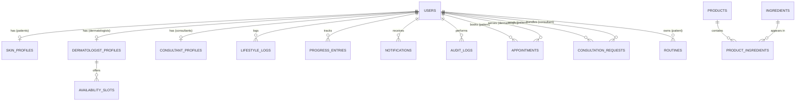

# Database Schema

Relational schema of record (PostgreSQL in production; SQLite locally). Defined in `backend/app/models.py`; tables are created by SQLAlchemy metadata and populated by `python -m app.seed`.

## Entity–relationship diagram

## Tables

### users
| Column | Type | Constraints |
|---|---|---|
| id | int | PK |
| email | varchar(255) | UNIQUE, NOT NULL, indexed |
| password_hash | varchar(255) | NOT NULL — PBKDF2-SHA256 |
| full_name | varchar(120) | NOT NULL |
| role | varchar(20) | `user` \| `dermatologist` \| `consultant` \| `admin`, indexed |
| is_active | bool | default true — false = suspended |
| is_verified | bool | providers require admin approval |
| created_at | datetime | default now |

### skin_profiles (1:1 with patient users)
`id PK · user_id FK→users UNIQUE · age · gender · skin_type · skin_tone · concerns · allergies · sensitivities · medical_history · current_products · goals · updated_at`

### lifestyle_logs
`id PK · user_id FK→users · log_date · sleep_hours · water_intake_l · exercise_minutes · stress_level (1–10) · environment_exposure · notes`
Constraint: `UNIQUE (user_id, log_date)` — one log per day, upserted.

### dermatologist_profiles (1:1)
`id PK · user_id FK UNIQUE · qualification · specialization · experience_years · clinic_name · location · languages · consultation_fee · consultation_types · bio · rating · is_approved · vacation_mode`

### availability_slots (weekly recurring)
`id PK · dermatologist_id FK→dermatologist_profiles · day_of_week (0=Mon…6=Sun) · start_time · end_time · slot_minutes`
Concrete bookable times are computed per date by expanding these windows and subtracting pending/confirmed appointments.

### appointments
`id PK · patient_id FK→users · dermatologist_id FK→users · appt_date · appt_time · consultation_type (video|clinic) · reason · status · doctor_notes · created_at`
Status machine: `pending → confirmed | rejected`; `confirmed → completed | cancelled`; patient may cancel/reschedule while pending or confirmed. Double-booking is rejected at write time.

### consultant_profiles (1:1)
`id PK · user_id FK UNIQUE · expertise · languages · bio · rating · is_approved`

### consultation_requests
`id PK · patient_id FK · consultant_id FK nullable (null = open to any consultant) · request_type (one_to_one | routine_planning | lifestyle | product | diet | anti_aging | sensitive_skin) · details · preferred_date · preferred_time · status (pending → accepted|rejected → completed; cancellable by patient) · created_at`

### routines
`id PK · patient_id FK · consultant_id FK · title · morning_steps (JSON) · night_steps (JSON) · weekly_steps (JSON) · lifestyle_advice · created_at`

### products / ingredients / product_ingredients
- **products**: `id · name · brand · category · price · tier (budget|premium) · suitable_for · description`
- **ingredients**: `id · name UNIQUE · benefits · cautions`
- **product_ingredients**: join table, `UNIQUE (product_id, ingredient_id)`

Seeded with 12 products and 12 ingredients (niacinamide, hyaluronic acid, retinol, salicylic acid, ceramides, …) with benefits and cautions — the dataset the Milestone 2 recommendation engine will consume.

### progress_entries
`id PK · user_id FK · entry_date · skin_score (0–100) · hydration (0–100) · acne_level (0–10, lower better) · pigmentation_level (0–10, lower better) · notes`

### notifications
`id PK · user_id FK · title · body · kind (info|appointment|consultation|routine|system) · is_read · created_at`

### audit_logs
`id PK · actor_id FK nullable · actor_email · action · entity · entity_id · old_value (JSON) · new_value (JSON) · ip · status · created_at`

## MongoDB (reserved)

Not required in Milestone 1. `database.get_mongo()` returns a handle when `MONGO_URL` is set; planned collections: `scan_images`, `scan_results`, `chat_transcripts`.

## Milestone 3 — Product & Ingredient catalogue (Part 1 & 2)

### `products` (extended)
Beyond the core fields, each product carries the full catalogue schema:
`skin_type_compat`, `concern_compat` (indexed), `ingredient_list`, `key_ingredients`,
`ingredient_benefits`, `usage_time` (AM/PM/both, indexed), `warnings`,
`contraindications`, `image_url`, `rating` (indexed), `review_count`, `source`,
and `external_id` (indexed — the dedup key for dataset imports).

### `ingredients` (knowledge base)
`description`, `scientific_category` (indexed), `benefits`, `side_effects`,
`skin_type_compat`, `concern_compat`, `comedogenic_rating` (0–5, indexed),
`references`. This is the single source of truth: products derive their
skin-type / concern compatibility and ingredient benefits from the linked KB
entries via the `product_ingredients` join table (FK-constrained, unique on
`(product_id, ingredient_id)`).

### Seeded volume
45 curated ingredients (fully populated knowledge base) and 49 products across
23 reputable brands and 10 categories, every extended field populated.

### Import & updates
`app/product_catalog.py` and `app/ingredient_kb.py` are the curated seed sources.
`app/import_dataset.py` ingests external CSV/JSON datasets (e.g. Kaggle),
de-duplicating on `(brand, name)` and `external_id` so re-imports and dataset
updates upsert rather than duplicate.
