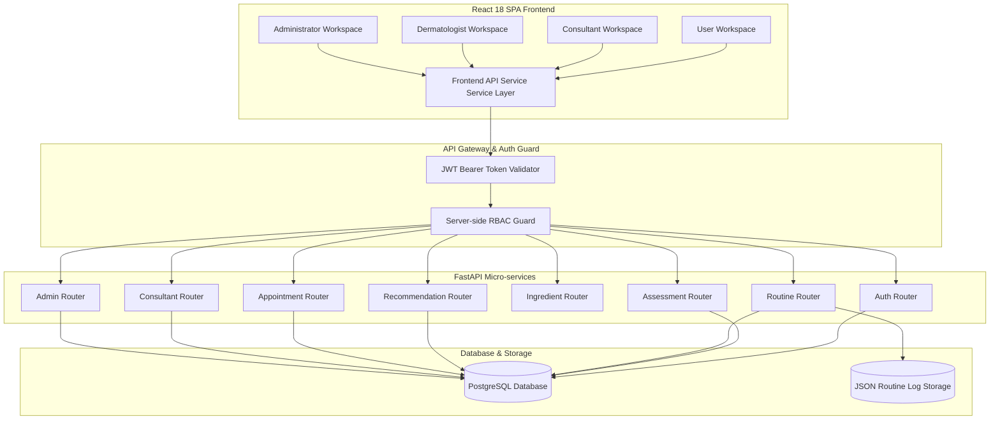

# MIRACLE — System Architecture Diagram

```mermaid
graph TD
    subgraph Client Layer [React 18 SPA Frontend]
        UI[User Workspace]
        CONS[Consultant Workspace]
        DERMA[Dermatologist Workspace]
        ADMIN[Administrator Workspace]
        API_SVC[Frontend API Service Service Layer]
    end

    subgraph Security Layer [API Gateway & Auth Guard]
        JWT[JWT Bearer Token Validator]
        RBAC[Server-side RBAC Guard]
    end

    subgraph Backend Layer [FastAPI Micro-services]
        AUTH_R[Auth Router]
        ASSESS_R[Assessment Router]
        ROUTINE_R[Routine Router]
        REC_R[Recommendation Router]
        INGR_R[Ingredient Router]
        APPT_R[Appointment Router]
        CONS_R[Consultant Router]
        ADMIN_R[Admin Router]
    end

    subgraph Persistence Layer [Database & Storage]
        DB[(PostgreSQL Database)]
        LOGS[(JSON Routine Log Storage)]
    end

    UI --> API_SVC
    CONS --> API_SVC
    DERMA --> API_SVC
    ADMIN --> API_SVC

    API_SVC --> JWT
    JWT --> RBAC

    RBAC --> AUTH_R
    RBAC --> ASSESS_R
    RBAC --> ROUTINE_R
    RBAC --> REC_R
    RBAC --> INGR_R
    RBAC --> APPT_R
    RBAC --> CONS_R
    RBAC --> ADMIN_R

    AUTH_R --> DB
    ASSESS_R --> DB
    ROUTINE_R --> DB
    ROUTINE_R --> LOGS
    REC_R --> DB
    APPT_R --> DB
    CONS_R --> DB
    ADMIN_R --> DB
```
