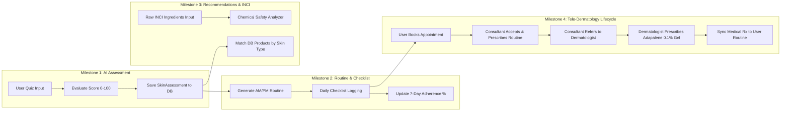

# MIRACLE — Four Milestone Flow Diagram

```mermaid
graph LR
    subgraph Milestone 1 [Milestone 1: AI Assessment]
        A[User Quiz Input] --> B[Evaluate Score 0-100]
        B --> C[Save SkinAssessment to DB]
    end

    subgraph Milestone 2 [Milestone 2: Routine & Checklist]
        C --> D[Generate AM/PM Routine]
        D --> E[Daily Checklist Logging]
        E --> F[Update 7-Day Adherence %]
    end

    subgraph Milestone 3 [Milestone 3: Recommendations & INCI]
        C --> G[Match DB Products by Skin Type]
        H[Raw INCI Ingredients Input] --> I[Chemical Safety Analyzer]
    end

    subgraph Milestone 4 [Milestone 4: Tele-Dermatology Lifecycle]
        E --> J[User Books Appointment]
        J --> K[Consultant Accepts & Prescribes Routine]
        K --> L[Consultant Refers to Dermatologist]
        L --> M[Dermatologist Prescribes Adapalene 0.1% Gel]
        M --> N[Sync Medical Rx to User Routine]
    end
```
