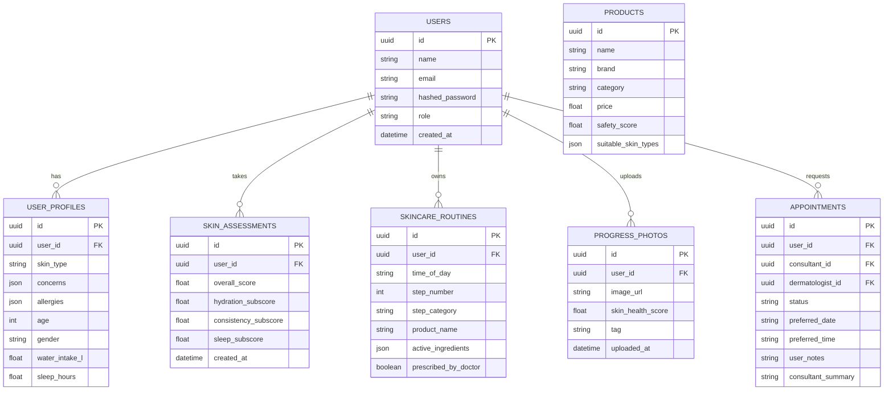

# MIRACLE — Database Architecture Entity-Relationship Diagram

```mermaid
erDiagram
    USERS ||--o{ USER_PROFILES : has
    USERS ||--o{ SKIN_ASSESSMENTS : takes
    USERS ||--o{ SKINCARE_ROUTINES : owns
    USERS ||--o{ PROGRESS_PHOTOS : uploads
    USERS ||--o{ APPOINTMENTS : requests

    USERS {
        uuid id PK
        string name
        string email
        string hashed_password
        string role
        datetime created_at
    }

    USER_PROFILES {
        uuid id PK
        uuid user_id FK
        string skin_type
        json concerns
        json allergies
        int age
        string gender
        float water_intake_l
        float sleep_hours
    }

    SKIN_ASSESSMENTS {
        uuid id PK
        uuid user_id FK
        float overall_score
        float hydration_subscore
        float consistency_subscore
        float sleep_subscore
        datetime created_at
    }

    SKINCARE_ROUTINES {
        uuid id PK
        uuid user_id FK
        string time_of_day
        int step_number
        string step_category
        string product_name
        json active_ingredients
        boolean prescribed_by_doctor
    }

    PROGRESS_PHOTOS {
        uuid id PK
        uuid user_id FK
        string image_url
        float skin_health_score
        string tag
        datetime uploaded_at
    }

    APPOINTMENTS {
        uuid id PK
        uuid user_id FK
        uuid consultant_id FK
        uuid dermatologist_id FK
        string status
        string preferred_date
        string preferred_time
        string user_notes
        string consultant_summary
    }

    PRODUCTS {
        uuid id PK
        string name
        string brand
        string category
        float price
        float safety_score
        json suitable_skin_types
    }
```
