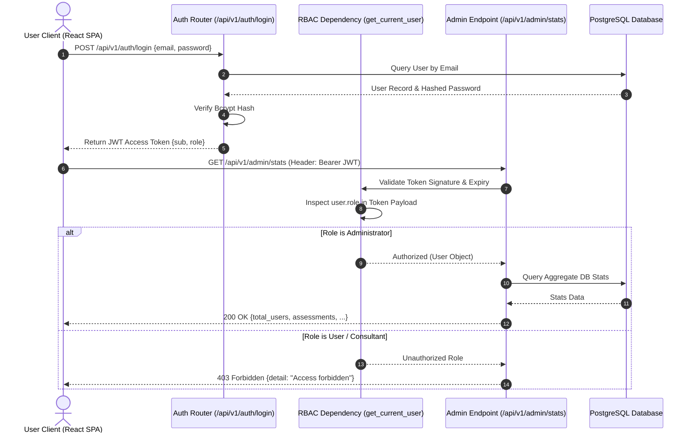

# MIRACLE — Authentication & Role-Based Access Control (RBAC) Diagram

```mermaid
sequenceDiagram
    autonumber
    actor User as User Client (React SPA)
    participant Auth as Auth Router (/api/v1/auth/login)
    participant Guard as RBAC Dependency (get_current_user)
    participant Admin as Admin Endpoint (/api/v1/admin/stats)
    participant DB as PostgreSQL Database

    User->>Auth: POST /api/v1/auth/login {email, password}
    Auth->>DB: Query User by Email
    DB-->>Auth: User Record & Hashed Password
    Auth->>Auth: Verify Bcrypt Hash
    Auth-->>User: Return JWT Access Token {sub, role}

    User->>Admin: GET /api/v1/admin/stats (Header: Bearer JWT)
    Admin->>Guard: Validate Token Signature & Expiry
    Guard->>Guard: Inspect user.role in Token Payload
    
    alt Role is Administrator
        Guard-->>Admin: Authorized (User Object)
        Admin->>DB: Query Aggregate DB Stats
        DB-->>Admin: Stats Data
        Admin-->>User: 200 OK {total_users, assessments, ...}
    else Role is User / Consultant
        Guard-->>Admin: Unauthorized Role
        Admin-->>User: 403 Forbidden {detail: "Access forbidden"}
    end
```
