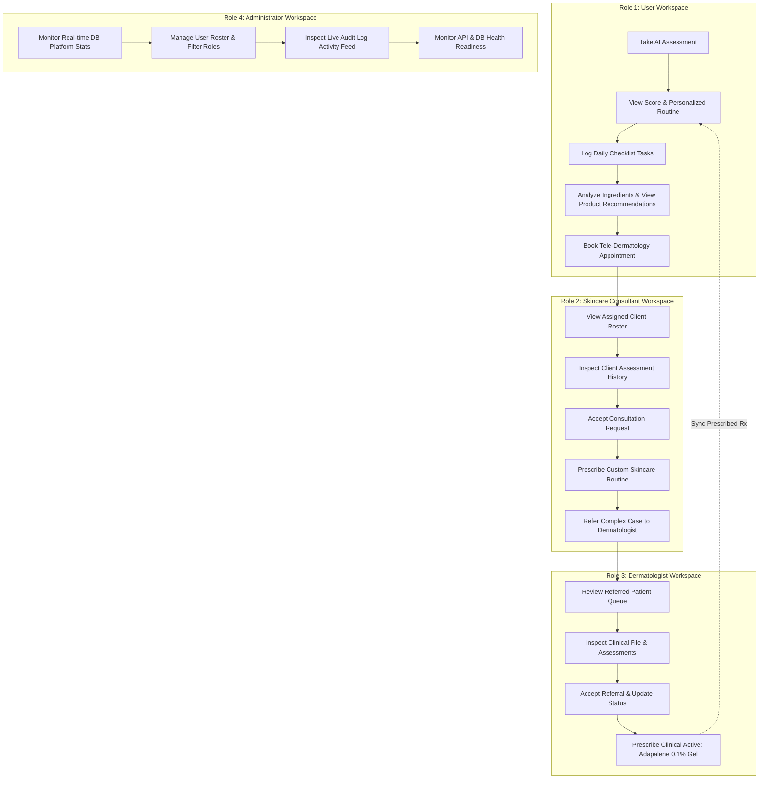

# MIRACLE — Four Role Dashboard Workflow Diagram

```mermaid
graph TD
    subgraph Role 1: User Workspace
        U1[Take AI Assessment] --> U2[View Score & Personalized Routine]
        U2 --> U3[Log Daily Checklist Tasks]
        U3 --> U4[Analyze Ingredients & View Product Recommendations]
        U4 --> U5[Book Tele-Dermatology Appointment]
    end

    subgraph Role 2: Skincare Consultant Workspace
        C1[View Assigned Client Roster] --> C2[Inspect Client Assessment History]
        C2 --> C3[Accept Consultation Request]
        C3 --> C4[Prescribe Custom Skincare Routine]
        C4 --> C5[Refer Complex Case to Dermatologist]
    end

    subgraph Role 3: Dermatologist Workspace
        D1[Review Referred Patient Queue] --> D2[Inspect Clinical File & Assessments]
        D2 --> D3[Accept Referral & Update Status]
        D3 --> D4[Prescribe Clinical Active: Adapalene 0.1% Gel]
    end

    subgraph Role 4: Administrator Workspace
        A1[Monitor Real-time DB Platform Stats] --> A2[Manage User Roster & Filter Roles]
        A2 --> A3[Inspect Live Audit Log Activity Feed]
        A3 --> A4[Monitor API & DB Health Readiness]
    end

    U5 --> C1
    C5 --> D1
    D4 -.->|Sync Prescribed Rx| U2
```
