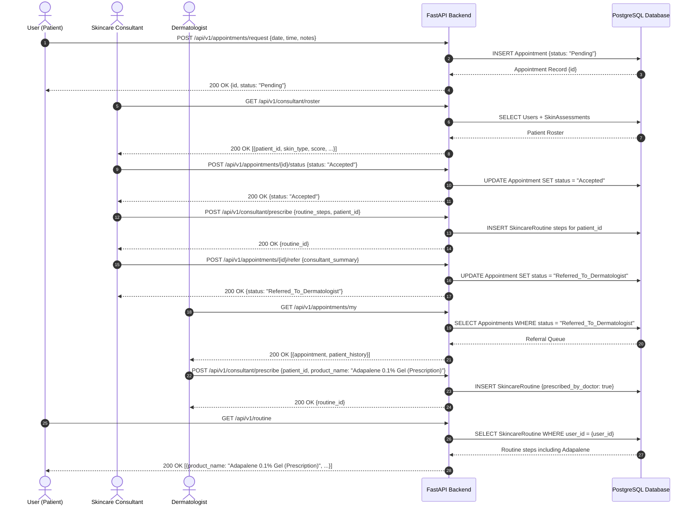

# MIRACLE — User-to-Dermatologist Clinical Lifecycle Diagram

```mermaid
sequenceDiagram
    autonumber
    actor U as User (Patient)
    actor C as Skincare Consultant
    actor D as Dermatologist
    participant API as FastAPI Backend
    participant DB as PostgreSQL Database

    U->>API: POST /api/v1/appointments/request {date, time, notes}
    API->>DB: INSERT Appointment {status: "Pending"}
    DB-->>API: Appointment Record {id}
    API-->>U: 200 OK {id, status: "Pending"}

    C->>API: GET /api/v1/consultant/roster
    API->>DB: SELECT Users + SkinAssessments
    DB-->>API: Patient Roster
    API-->>C: 200 OK [{patient_id, skin_type, score, ...}]

    C->>API: POST /api/v1/appointments/{id}/status {status: "Accepted"}
    API->>DB: UPDATE Appointment SET status = "Accepted"
    API-->>C: 200 OK {status: "Accepted"}

    C->>API: POST /api/v1/consultant/prescribe {routine_steps, patient_id}
    API->>DB: INSERT SkincareRoutine steps for patient_id
    API-->>C: 200 OK {routine_id}

    C->>API: POST /api/v1/appointments/{id}/refer {consultant_summary}
    API->>DB: UPDATE Appointment SET status = "Referred_To_Dermatologist"
    API-->>C: 200 OK {status: "Referred_To_Dermatologist"}

    D->>API: GET /api/v1/appointments/my
    API->>DB: SELECT Appointments WHERE status = "Referred_To_Dermatologist"
    DB-->>API: Referral Queue
    API-->>D: 200 OK [{appointment, patient_history}]

    D->>API: POST /api/v1/consultant/prescribe {patient_id, product_name: "Adapalene 0.1% Gel (Prescription)"}
    API->>DB: INSERT SkincareRoutine {prescribed_by_doctor: true}
    API-->>D: 200 OK {routine_id}

    U->>API: GET /api/v1/routine
    API->>DB: SELECT SkincareRoutine WHERE user_id = {user_id}
    DB-->>API: Routine steps including Adapalene
    API-->>U: 200 OK [{product_name: "Adapalene 0.1% Gel (Prescription)", ...}]
```
