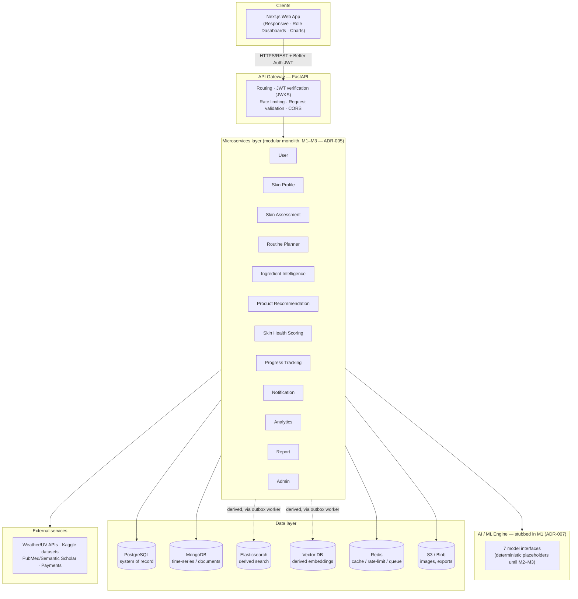

# System Architecture — Milestone 1

Full detail lives in `docs/ARCHITECTURE.md` (authoritative — if this summary and that
file ever disagree, `docs/ARCHITECTURE.md` wins). This document exists so Milestone 1's
"design the system architecture + prepare a diagram" task has a standalone artifact.

## 1. What the system does

An AI-powered skin intelligence and personalized skincare planner. It analyzes a user's
skin profile, lifestyle habits, sleep, hydration, and environmental exposure to produce:
an AI skin assessment, a weighted Skin Health Score, personalized routines, ingredient
intelligence, product recommendations, and progress tracking.

**Four roles**, each with its own dashboard and permission boundary:

| Role | Does | Primary surfaces |
|---|---|---|
| `user` | Skin profile, lifestyle logs, assessments, routines, recommendations, progress | User dashboard, profile, assessment, recommendations, progress |
| `consultant` | Reviews assigned clients' profiles/assessments/progress, notes, manages recs | Consultant dashboard |
| `dermatologist` | Patient insights, condition reports, treatment recommendations, progress analytics | Dermatologist dashboard |
| `admin` | User management, content (products/ingredients/articles), platform analytics, monitoring | Admin dashboard |

Roles are issued as a JWT claim by Better Auth and **re-checked on every FastAPI
endpoint** via a `require_role(...)` dependency — a role that can't see a nav item has no
working endpoint behind it either (enforced in Milestone 1, see
[`03-api-endpoints.md`](./03-api-endpoints.md)).

## 2. High-level diagram

**Request lifecycle (every authenticated call):**
1. Next.js client attaches the Better Auth JWT (`web/lib/api.ts`).
2. Gateway middleware: request-id assignment → CORS → rate limit (Redis) → JWT
   signature/`iss`/`aud`/`exp` verification against cached JWKS → Pydantic request
   validation.
3. A route dependency enforces role (and, where applicable, ownership); the handler
   calls its own service module only.
4. Each service reads/writes **only the stores it owns** — cross-service needs go
   through the other service's interface function, never its tables directly.
5. Response returns with `X-Request-ID`; a structured JSON log line records latency;
   errors use the standard envelope (`docs/CONVENTIONS.md`).

## 3. Deployment shape

A **modular monolith** for Milestone 1–3: one FastAPI deployable, the 12 services above
as internal routers/modules under `backend/app/services/*`, each owning its data
exclusively (ADR-005). Split into per-service containers at Milestone 4. All routes
mount under `/api/v1` from day one (ADR-009).

M1 local runtime (`docker-compose.yml`): `postgres`, `mongo`, `redis`, `elasticsearch` —
plus `web` (Next.js) and `backend` (FastAPI) run directly (via `docker_run.py` +
`backend_run.py` + `web_run.py`, one script per concern, or `make dev`), not yet
containerized themselves (tracked as a M1 "Partially Completed" item in `PROGRESS.md`;
`web`/`api`/`minio`/`worker` compose entries land once verified against a
Docker-available session).

## 4. Data layer — five stores + one file store

| Store | Source of truth for | M1 status |
|---|---|---|
| **PostgreSQL** | Identity (Better Auth), skin profiles, skin taxonomy, ingredients + junctions, products, routines, scores + `scoring_weights` | Live, system of record |
| **MongoDB** | Lifestyle logs (time-series), AI assessment payloads, progress logs, preferences, weather/UV logs | Live |
| **Redis** | Sessions/blacklist, rate limits, recommendation cache | Live |
| **Elasticsearch** | *Derived* search (products/ingredients/articles) | Not wired in M1 (ADR-010 — worker lands M2) |
| **Vector DB** (FAISS dev / Pinecone prod) | *Derived* embeddings | Not wired in M1 |
| **S3 / Blob** | Profile images, scan images, progress photos, exports | Not wired in M1 (no upload surfaces built yet) |

Full schema detail: [`02-database-schema.md`](./02-database-schema.md).

## 5. Authentication & authorization (ADR-002/003)

**Better Auth (Next.js) is the single auth authority** — registration, login, scrypt
password hashing, Google OAuth2, sessions. Its JWT plugin issues short-lived
(~15 min) asymmetric EdDSA/RS256 JWTs and serves JWKS at `/api/auth/jwks`.

**FastAPI validates, never authenticates** — one dependency pair,
`require_user` / `require_role(...)` (`backend/app/core/security.py`), caches JWKS and
verifies signature/`iss`/`aud`/`exp` on every request. No shared secret, no duplicated
auth logic. Redis backs an optional `auth:blacklist:{jti}` for instant revocation.

Identity tables (`user`, `session`, `account`, `verification`, `jwks`) are owned by
Better Auth, not Alembic. Every domain `user_id` is `TEXT REFERENCES "user"(id)` — never
a serial integer (ADR-003) — so role can never drift from the identity system's own
record of who the user is.

## 6. AI / ML — stubbed by design in M1 (ADR-007)

Seven model surfaces (skin-type classification, concern detection, recommendation
ranking, ingredient suitability, score prediction, progress trend analysis, NLP/
embeddings) exist as **interfaces returning deterministic, `hash(user_id)`-seeded
placeholder results** behind `backend/app/ai/`. Real models land Milestone 2–3 behind the
same contracts — frontend and API shapes are already stable, so swapping a stub for a
real model is an internal change, not a breaking one.

## 7. Cross-cutting concerns

- **Observability:** structured JSON logs with a `request_id` propagated from frontend
  through every service; per-request latency logged.
- **Security:** TLS in transit (prod), RBAC + ownership checks on every route,
  secrets via env only, no hard-coded credentials.
- **"Not medical advice":** visible on assessment-adjacent screens — AI-derived output
  is framed as an estimate, never a diagnosis.
