# Database Schema — Milestone 1

Source of truth: `database_schemas/skinlytics_postgresql_schema_v3.sql` (PostgreSQL DDL,
31 tables + Better Auth's identity tables), `skinlytics_mongodb_schema_v3.txt` (MongoDB),
`skinlytics_infrastructure_layer_v2.txt` (Redis + S3), `skinlytics_identity_betterauth.md`
(Better Auth's own generated tables). This document summarizes them for the Milestone 1
"design the database" deliverable — for exact column types/constraints, read the `.sql`
file directly; this doc will drift on detail before that one does.

## 1. PostgreSQL — system of record

**Design rule (ADR-003):** every domain `user_id` / `consultant_id` is
`TEXT REFERENCES "user"(id)` — Better Auth owns identity with string IDs; the app never
reintroduces integer user IDs. **Design rule (ADR-001):** relationship queries
(ingredient↔concern, product↔skin-type) are indexed junction-table joins, not a graph
database.

### Entity-relationship diagram (Milestone 1 core tables)

```mermaid
erDiagram
    USER ||--o| USER_PROFILES : "has one"
    USER ||--o{ SKIN_PROFILES : "has versions of"
    USER ||--o{ ROUTINES : "has"
    USER ||--o{ SKIN_SCORES : "accumulates"
    USER ||--o{ CONSULTANT_CLIENTS : "is assigned (as client)"
    USER ||--o{ CONSULTANT_CLIENTS : "is assigned (as consultant)"

    SKIN_TYPES ||--o{ SKIN_PROFILES : "classifies"
    SKIN_PROFILES ||--o{ SKIN_PROFILE_CONCERNS : "has"
    SKIN_CONCERNS ||--o{ SKIN_PROFILE_CONCERNS : "referenced by"

    SKIN_CONCERNS ||--o{ INGREDIENT_CONCERN_TREATS : "treated by"
    INGREDIENTS ||--o{ INGREDIENT_CONCERN_TREATS : "treats"
    SKIN_TYPES ||--o{ INGREDIENT_SKINTYPE_AVOID : "should avoid"
    INGREDIENTS ||--o{ INGREDIENT_SKINTYPE_AVOID : "flagged for"

    PRODUCTS ||--o{ PRODUCT_INGREDIENTS : "contains"
    INGREDIENTS ||--o{ PRODUCT_INGREDIENTS : "found in"
    PRODUCTS ||--o{ PRODUCT_SKIN_TYPES : "suited for"
    PRODUCTS ||--o{ PRODUCT_CONCERNS : "addresses"

    ROUTINES ||--o{ ROUTINE_STEPS : "has steps"
    ROUTINE_STEPS ||--o{ ROUTINE_PRODUCTS : "uses"
    PRODUCTS ||--o{ ROUTINE_PRODUCTS : "used in"

    SCORING_WEIGHTS ||--o{ SKIN_SCORES : "weights"

    USER {
        text id PK
        text email
        text role "user|consultant|dermatologist|admin"
    }
    USER_PROFILES {
        int profile_id PK
        text user_id FK
        date date_of_birth
        string gender
    }
    SKIN_TYPES {
        int skin_type_id PK
        string skin_type_name "Normal|Dry|Oily|Combination|Sensitive"
    }
    SKIN_CONCERNS {
        int concern_id PK
        string concern_name "10 seeded concerns"
        string category
    }
    SKIN_PROFILES {
        int skin_profile_id PK
        text user_id FK
        int skin_type_id FK
        bool is_current "versioned, not overwritten"
    }
    SKIN_PROFILE_CONCERNS {
        int profile_concern_id PK
        int skin_profile_id FK
        int concern_id FK
        int severity_rating "1-10"
        int priority_level "1-10"
    }
    INGREDIENTS {
        int ingredient_id PK
        string ingredient_name UK
        string inci_name
        string category "Retinoids|Niacinamide|Vitamin C|..."
    }
    INGREDIENT_CONCERN_TREATS {
        int id PK
        int ingredient_id FK
        int concern_id FK
        string evidence_strength "weak|moderate|strong"
    }
    INGREDIENT_SKINTYPE_AVOID {
        int id PK
        int ingredient_id FK
        int skin_type_id FK
        text reason
    }
    PRODUCTS {
        int product_id PK
        string brand_name
        string product_name
        string category
        decimal price
        string currency
    }
    PRODUCT_INGREDIENTS {
        int id PK
        int product_id FK
        int ingredient_id FK
    }
    PRODUCT_SKIN_TYPES {
        int id PK
        int product_id FK
        int skin_type_id FK
    }
    PRODUCT_CONCERNS {
        int id PK
        int product_id FK
        int concern_id FK
    }
    ROUTINES {
        int routine_id PK
        text user_id FK
        string routine_type "AM|PM"
        bool is_active
    }
    ROUTINE_STEPS {
        int step_id PK
        int routine_id FK
        int step_order
        string step_name
    }
    ROUTINE_PRODUCTS {
        int id PK
        int step_id FK
        int product_id FK
    }
    SCORING_WEIGHTS {
        int weight_id PK
        decimal skin_condition_weight "0.35"
        decimal lifestyle_weight "0.20"
        decimal sleep_quality_weight "0.15"
        decimal routine_adherence_weight "0.20"
        decimal hydration_weight "0.10"
        bool is_active
    }
    SKIN_SCORES {
        int score_id PK
        text user_id FK
        int weight_id FK
        decimal overall_score
        timestamp calculated_at
    }
    CONSULTANT_CLIENTS {
        int assignment_id PK
        text consultant_id FK
        text user_id FK
        string status "active|paused|ended"
    }
```

### Every table (31, grouped)

| Group | Tables |
|---|---|
| Identity (Better Auth-owned, not Alembic) | `user`, `session`, `account`, `verification`, `jwks` |
| User & skin profile | `user_profiles`, `skin_types`, `skin_concerns`, `skin_profiles`, `skin_profile_concerns` |
| Ingredients | `ingredients`, `ingredient_concern_treats`, `ingredient_skintype_avoid` |
| Routines & products | `routines`, `routine_steps`, `products`, `product_ingredients`, `product_skin_types`, `product_concerns`, `routine_products` |
| Scoring & progress | `scoring_weights`, `skin_scores`, `progress_reports`, `progress_images`, `product_recommendations` |
| Consulting | `consultant_clients`, `consultant_notes` |
| Notifications & billing | `notifications`, `reminders`, `subscriptions`, `payments` |

### Constraints worth calling out
- `scoring_weights` has a `CHECK` constraint enforcing the five weights sum to exactly
  `1.00` — the Skin Health Score formula is config-driven, not hard-coded.
  `severity_rating`/`priority_level` on `skin_profile_concerns` are `CHECK`-constrained
  to `1..10`.
- `ingredient_concern_treats.evidence_strength` is `CHECK`-constrained to
  `weak | moderate | strong`.
- Every FK from a domain table to `"user"(id)` is `ON DELETE CASCADE` where the row is
  personal data (profile, skin profile, scores, routines) — deleting a user cleans up
  their data; verified live during Milestone 1 development (test user deletion cascaded
  correctly, per root `PROGRESS.md`).
- `skin_profiles.is_current` — profile edits are versioned (a new row, previous rows kept
  with `is_current = false`), not destructively overwritten.

## 2. MongoDB — time-series & document data

| Collection | Holds | M1 status |
|---|---|---|
| `lifestyle_logs` | Sleep, water, exercise, stress, diet, environmental exposure — one upsert per user per day | Live, real writes |
| `weather_uv_logs` | Cached weather/UV pulls | Not wired (M1 — no OpenWeather/OpenUV keys configured yet) |
| `skin_assessments` | AI assessment payloads | Not built (M2 — real Skin Assessment service) |
| `progress_logs` | Before/after photos, milestones | Not built (M2+, full Progress screen) |
| `knowledge_articles` | Curated dermatology summaries + citations | Not built (M2–M3) |

## 3. Redis — cache, sessions, rate limits

Sessions/blacklist (`auth:blacklist:{jti}`), rate limiting, and the recommendation cache
(`recommendation:cache:{user_id}`, TTL 24h — invalidated on every skin-profile save) are
live and verified in Milestone 1.

## 4. Not yet wired in M1 (by design)

Elasticsearch (derived search) and the Vector DB (derived embeddings, FAISS dev /
Pinecone prod) are **derived stores** per ADR-010 — they're synced from Postgres/Mongo
via a background worker that lands in Milestone 2, not authored directly. Standing them
up empty in M1 would just be an unused client with nothing to serve.
